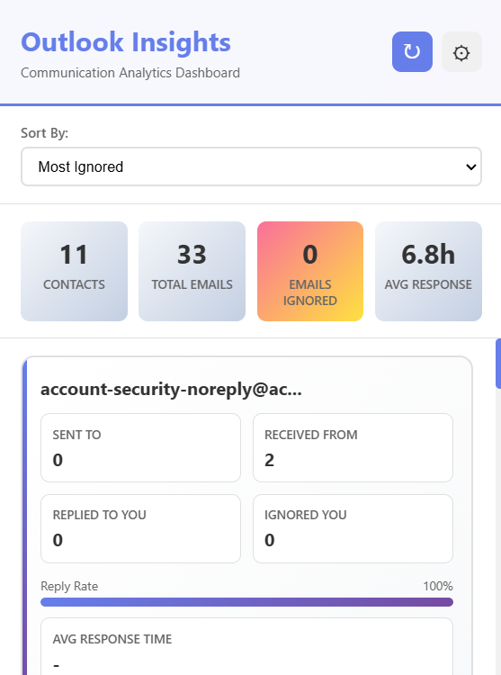
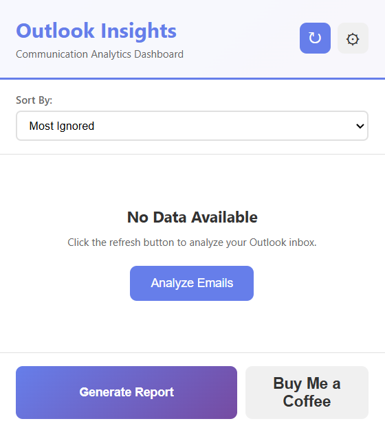
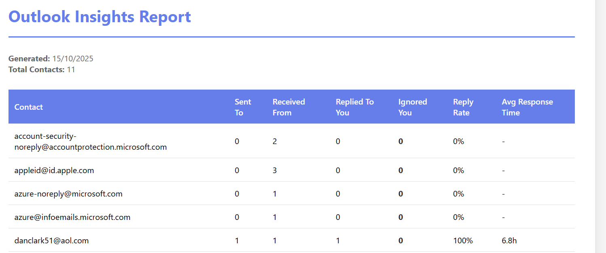
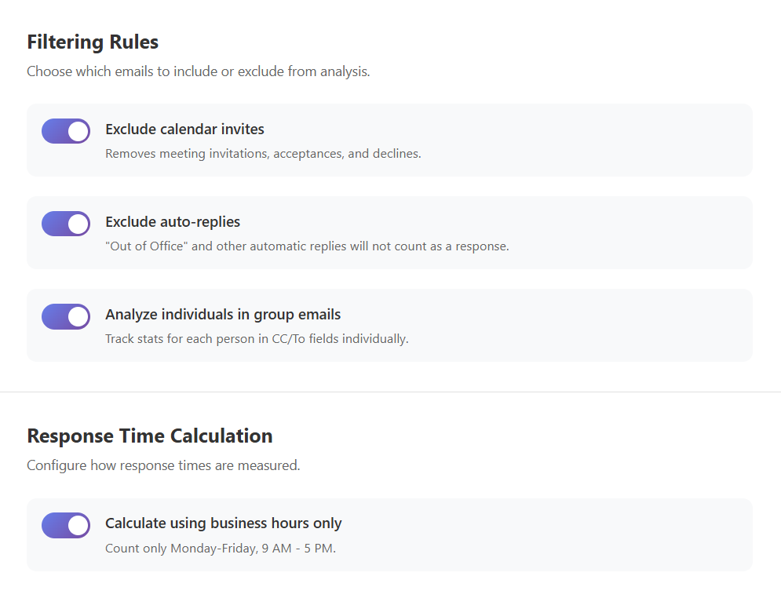
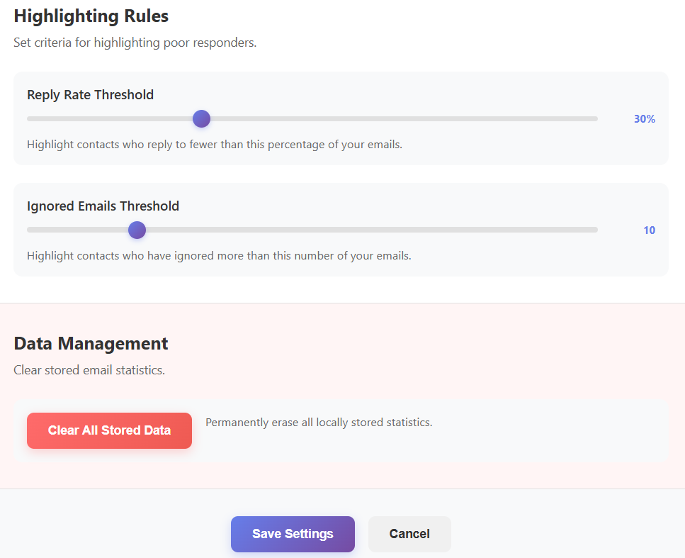

# Outlook Insights Dashboard
A browser extension that analyzes your Outlook inbox to provide insights into your communication patterns, tracking response times and identifying ignored emails.

This tool performs all analysis locally on your device without ever sending your email data to an external server.

Features
Email Analytics: Get statistics on emails sent, received, unique contacts, and average response times.

Ignored Email Tracking: Identifies and highlights contacts with low reply rates based on your criteria.

Response Time Metrics: Calculates the average time it takes for contacts to reply, with an option for business hours only.

Exportable Reports: Generates a clean HTML report of your analysis for sharing or personal records.

Privacy-Focused: All analysis happens locally. The extension uses the minimal Mail.ReadBasic permission, which does not allow it to read email bodies.

Installation
Clone the repository:

git clone [https://github.com/your-username/your-repo.git](https://github.com/your-username/your-repo.git)

Load the extension in your browser:

Open Chrome/Edge and navigate to chrome://extensions or edge://extensions.

Enable "Developer mode".

Click "Load unpacked" and select the cloned repository folder.

How It Works
After installation, click the extension icon in your browser toolbar. Initially, you will be prompted to begin the analysis.

Click "Analyze Emails" to securely authenticate with your Microsoft account. The extension will then fetch and process your email metadata locally, populating the dashboard with your communication statistics. From the dashboard, you can also generate a downloadable HTML report.

Settings and Customization
The settings page gives you full control over the analysis. You can define the analysis period, set up filtering rules to exclude calendar invites or auto-replies, and customize the thresholds for highlighting poor responders.

Privacy and Security
Local Processing: All analysis is performed on your machine. No data is sent to external servers.

Minimal Permissions: The extension requests Mail.ReadBasic permission, which only allows access to email metadata (sender, date, subject), not the email body.

Secure Authentication: Authentication is handled via the standard Microsoft Identity Platform (OAuth 2.0). The extension never has access to your password.

Contributing
Contributions are welcome. Please fork the repository, make your changes, and submit a pull request.

License
This project is licensed under the MIT License.
